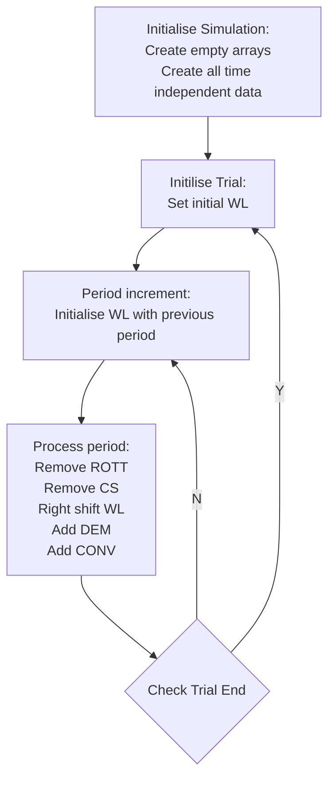

# Devon Referral to Treatment (RTT) Model in R

#### Author: Richard Blackwell
#### Email: richard.blackwell@swahsn.com
#### Date: 2023-08-04

## Structure

----

### General

Variables ending in `nonadm` refer to the **non-admitted pathway** and those ending in `adm` refer to the **admitted pathway**. A variable displayed as `variable_name_...` in this README signifies that both the `variable_name_nonadm` and `variable_name_adm` variables are being referred to.

### Simulation variables

- `sim_name` - Name of the simulation for use in output directory and filenames.
- `sim_trials` - Number of simulation runs.
- `sim_periods` - Number of time periods each simulation will run for.
- `sim_bins` - Number of bins to use for the waiting list i.e. `sim_bins = 52` will monitor waits from >=0 weeks and <1 week through to >=52 weeks. **NB: Bin zero will always be added so we do not need to add that into the number required**
- `sim_time_unit` - Unit of time for the model i.e. year, month, week, day.

**NB: the same unit of time will be used across the entire model, i.e. if we use week then the demand is expressed in weekly demand, the capacity in weekly capacity, the waiting list bins as weekly bins.**

----

### **Profile variables**

### Clock Stop Profile variables
- `csprof_type_nonadm` & `csprof_type_adm` - Type of clock stop profile input, either `matrix` (read direct from input file) or `dist` (created from beta-binomial distribution using parameters supplied in input file)
- `csprof_param_nonadm` & `csprof_param_adm` - If the `csprof_type_...` is `dist` this is an array of `[sim_period, 2]` in which to store shape parameter 1 (also know as $\alpha$ ) and shape parameter 2 (also know as $\beta$ ) used to define the shape of the beta-binomial distribution of the clock stop profile for each simulation period.
- `csprof_nonadm` & `csprof_adm` - Array of dimensions `[sim_periods, sim_bins+1]` in which to store the clock stop profile in bins for each simulation period.

### Demand Profile variables
- `demprof_type_nonadm` & `demprof_type_adm` - Type of demand profile input, either `matrix` (read direct from input file) or `dist` (created from beta-binomial distribution using parameters supplied in input file)
- `demprof_param_nonadm` & `demprof_param_adm` - If the `demprof_type_...` is `dist` this is an array of `[sim_period, 2]` in which to store shape parameter 1 (also know as $\alpha$ ) and shape parameter 2 (also know as $\beta$ ) used to define the shape of the beta-binomial distribution of the demand profile for each simulation period.
- `demprof_nonadm` & `demprof_adm` - Array of dimensions `[sim_periods, sim_bins+1]` in which to store the demand profile in bins for each simulation period.

### Removal Other Than Treatment (ROTT) Profile variables
- `rottprof_type_nonadm` & `rottprof_type_adm` - Type of ROTT profile input, either `matrix` (read direct from input file) or `dist` (created from beta-binomial distribution using parameters supplied in input file)
- `rottprof_param_nonadm` & `demprof_param_adm` - If the `rottprof_type_...` is `dist` this is an array of `[sim_period, 2]` in which to store shape parameter 1 (also know as $\alpha$ ) and shape parameter 2 (also know as $\beta$ ) used to define the shape of the beta-binomial distribution of the ROTT profile for each simulation period.
- `rottprof_nonadm` & `rottprof_adm` - Array of dimensions `[sim_periods, sim_bins+1]` in which to store the ROTT profile in bins for each simulation period.

----

### **Variables**

### Waiting List variables
- `wl_type_nonadm` & `wl_type_adm` - Type of waiting list input, either `matrix` (read direct from input file) or `dist` (created from beta-binomial distribution using parameters supplied in input file).
- `wl_size_nonadm` & `wl_size_adm` - If the `wl_type_...` is `dist` this is size of the waiting list to be created using the beta-binomial distribution.
- `wl_shape1_nonadm` & `wl_shape1_adm` - If the `wl_type_...` is `dist` this is shape parameter 1 (also know as $\alpha$ ) used to define the shape of the beta-binomial distribution.
- `wl_shape2_nonadm` & `wl_shape2_adm` - If the `wl_type_...` is `dist` this is shape parameter 2 (also know as $\beta$ ) used to define the shape of the beta-binomial distribution.
- `wl_nonadm` & `wl_adm` - Array of dimension `[sim_periods+1, sim_bins+1, sim_trials]` in which to store the waiting list in bins for each simulation period and run. **NB: Dimensions are `sim_periods+1` as the starting waiting list (period 0) will also be recorded, and `sim_bins+1` as the waiting list bins run from zero through to sim_bins.**

### Clock Stop variables
- `cs_nonadm` & `cs_adm` - Array of dimensions `[sim_periods, sim_bins+1, sim_trails]` in which to store the clock stops by bin for each simulation trial and simulation period.

### Demand variables
- `dem_param_nonadm` & `dem_param_adm` - Array of dimensions `[sim_periods, 2]` in which to store the mean and standard deviations parameters for each simulation period used to create the `dem_vol_...` from a normal distribution.
- `dem_vol_nonadm` & `dem_vol_adm` - Array of dimensions `[sim_periods, sim_trials]` used to store the demand volume for the non-admitted and admitted pathways for each period and simulation run.
- `dem_nonadm` & `dem_adm` - Array of dimensions `[sim_periods, sim_bins+1, sim_trials]` in which to store the demand delivery in bins for each simulation period and run.

### Capacity variables
- `cap_param_nonadm` & `cap_param_adm` - Array of dimensions `[sim_periods, 2]` in which to store the mean and standard deviations parameters for each simulation period used to create the `cap_vol_...` from a normal distribution.
- `cap_vol_nonadm` & `cap_vol_adm` - Array of dimensions `[sim_periods, sim_trials]` used to store the capacity volume for the non-admitted and admitted pathways for each period and simulation run.

### Non-RTT variables
- `nonrtt_param_nonadm` & `nonrtt_param_adm` - Array of dimension `[sim_periods]` in which to store the probability parameter for each simulation period used to create the `nonrtt_vol_...` from a binominal distribution
- `nonrtt_vol_nonadm` & `nonrtt_vol_adm` - Array of dimensions `[sim_periods, sim_trials]` used to store the non-RTT volume for the non-admitted and admitted pathways for each period and simulation run.

### Removal Other Than Treatment (ROTT) variables
- `rott_param_nonadm` & `rott_param_adm` - Array of dimension `[sim_periods]` in which to store the probability parameter for each simulation period used to create the `rott_vol_...` from a binominal distribution
- `rott_vol_nonadm` & `rott_vol_adm` - Array of dimensions `[sim_periods, sim_trials]` used to store the ROTT volume for the non-admitted and admitted pathways for each period and simulation run.
- `rott_nonadm` & `rott_adm` - Array of dimensions `[sim_periods, sim_bins+1, sim_trials]` in which to store the ROTT activity in bins for each simulation period and run.

### Conversion variables
- `conv_param_nonadm` & `conv_param_adm` - Array of dimension `[sim_periods]` in which to store the probability parameter for each simulation period used to create the `conv_vol_...` from a binominal distribution
- `conv_vol_nonadm` & `conv_vol_adm` - Array of dimensions `[sim_periods, sim_trials]` used to store the conversion volume for the non-admitted (to admitted) and admitted (to non-admitted) pathways for each period and simulation run.
- `conv_nonadm` & `conv_adm` - Array of dimensions `[sim_periods, sim_bins+1, sim_trials]` in which to store the conversion activity in bins for each simulation period and run.

----

### **Simplified Flowchart**

